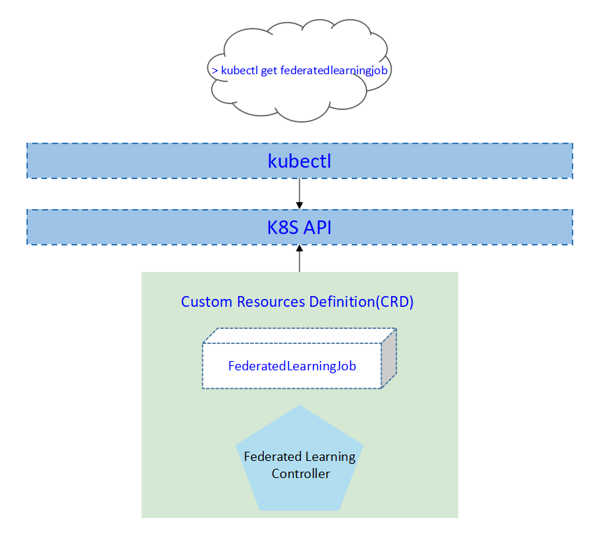
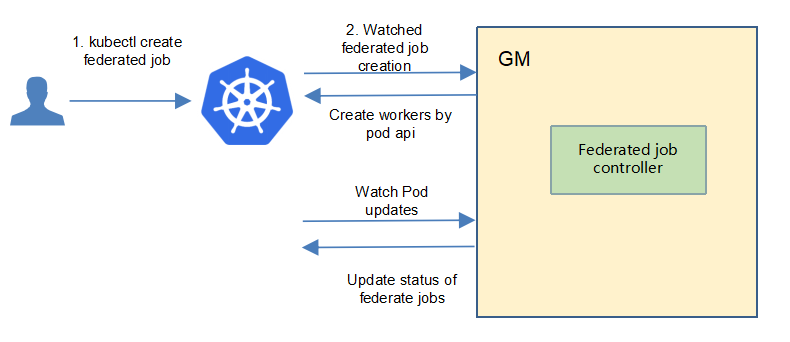
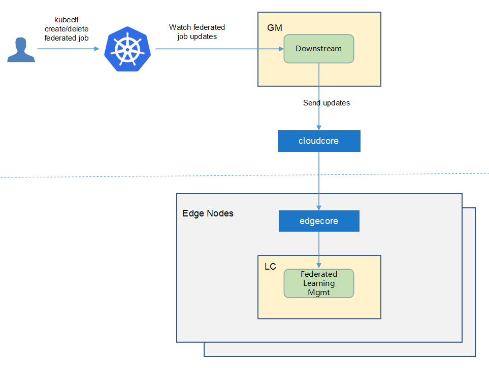
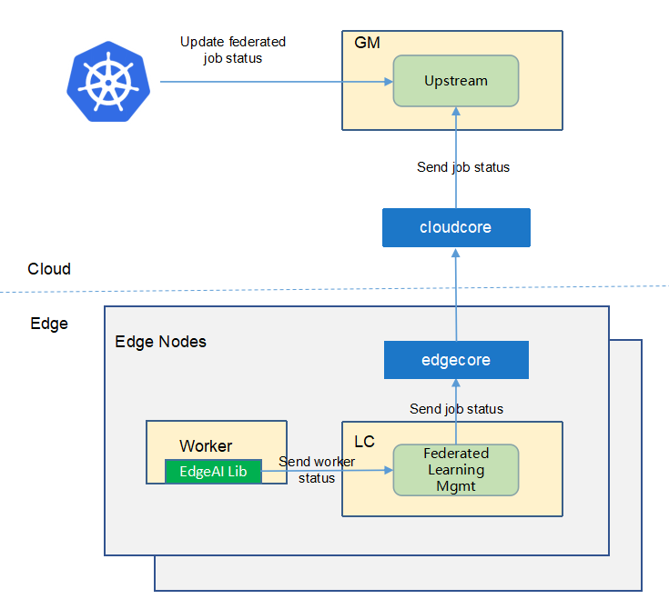
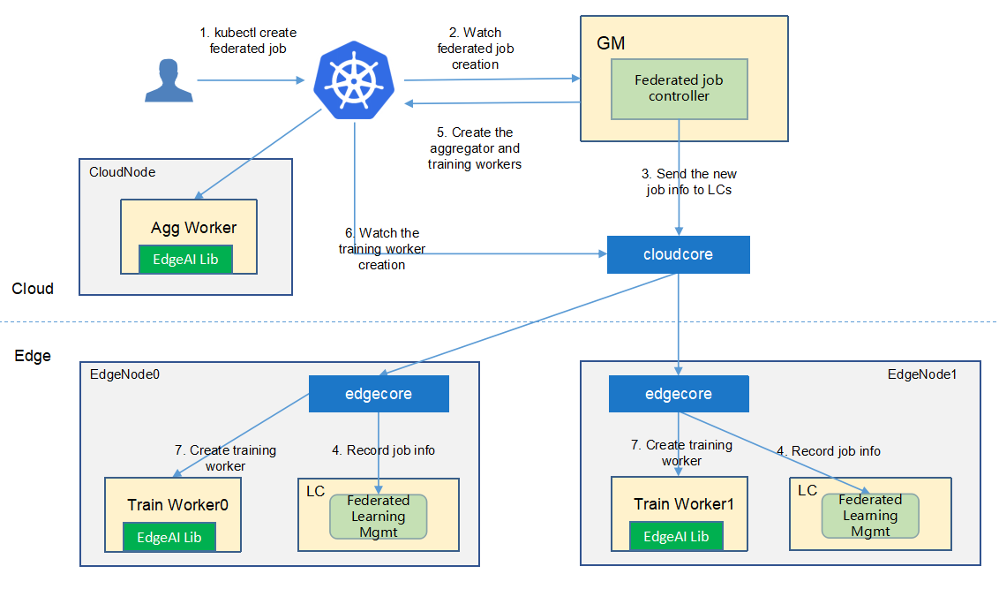

* [Federated Learning](#federated-learning)
   * [Motivation](#motivation)
     * [Goals](#goals)
     * [Non\-goals](#non-goals)
   * [Proposal](#proposal)
     * [Use Cases](#use-cases)
   * [Design Details](#design-details)
     * [CRD API Group and Version](#crd-api-group-and-version)
     * [Federated learning CRD](#federated-learning-crd)
     * [Federated learning type definition](#federated-learning-type-definition)
     * [Federated learning sample](#federated-learning-sample)
     * [Validation](#validation)
   * [Controller Design](#controller-design)
     * [Federated Learning Controller](#federated-learning-controller)
     * [Downstream Controller](#downstream-controller)
     * [Upstream Controller](#upstream-controller)
     * [Details of api between GM(cloud) and LC(edge)](#details-of-api-between-gmcloud-and-lcedge)
   * [Workers Communication](#workers-communication)
   
# Federated Learning
## Motivation

For edge AI, data is naturally generated at the edge. based on these assumptions:
* Users are unwilling to upload raw data to the cloud because of data privacy.
* Users do not want to purchase new devices for centralized training at the edge. 
* The sample size at the edge is usually small, and it is often difficult to train a good model at a single edge node.

Therefore, we propose a edge cloud federated learning framework to help to train a model **without uploading raw data**, and **higher precision** and **less convergence time** are also benefits.


### Goals

* The framework can combine data on multiple edge nodes to complete training.
* The framework provides the functions of querying the training status and result.
* The framework integrates some common aggregation algorithms, FedAvg and so on.
* The framework integrates some common weight/gradient compression algorithm to reduce the cloud-edge traffic required for aggregation operations.
* The framework integrates some common multi-job migration algorithms to resolve the problem of low precision caused by small size samples.


## Proposal
We propose using Kubernetes Custom Resource Definitions (CRDs) to describe 
the federated learning specification/status and a controller to synchronize these updates between edge and cloud.



### Use Cases


* User can create a federated learning job, with providing a training script, specifying the aggregation algorithm, configuring training hyperparameters, configuring training datasets.

* Users can get the federated learning status, including the nodes participating in training, current training status, samples size of each node, current iteration times, and current aggregation times.

* Users can get the saved aggregated model. The model file can be stored on the cloud or edge node.

 

## Design Details
### CRD API Group and Version
The `FederatedLearningJob` CRD will be namespace-scoped.
The tables below summarize the group, kind and API version details for the CRD.

* FederatedLearningJob

| Field                 | Description             |
|-----------------------|-------------------------|
|Group                  | sedna.io     |
|APIVersion             | v1alpha1                |
|Kind                   | FederatedLearningJob             |


### Federated learning CRD
Below is the CustomResourceDefinition yaml for `FederatedLearningJob`:
[crd source](/build/crds/sedna.io_jointinferenceservices.yaml)

### Federated learning type definition

[go source](/pkg/apis/sedna/v1alpha1/federatedjob_types.go)

#### Validation
[Open API v3 Schema based validation](https://kubernetes.io/docs/jobs/access-kubernetes-api/custom-resources/custom-resource-definitions/#validation) can be used to guard against bad requests.
Invalid values for fields ( example string value for a boolean field etc) can be validated using this.

Here is a list of validations we need to support :
1. The `dataset` specified in the crd should exist in k8s.
1. The `model` specified in the crd should exist in k8s.
1. The edgenode name specified in the crd should exist in k8s.

### federated learning sample
see [sample source](/build/crd-samples/sedna/federatedlearningjob_v1alpha1.yaml)

### Creation of the federated learning job

## Controller Design
The federated learning controller starts three separate goroutines called `upstream`, `downstream` and `federated-learning`controller. These are not separate controllers as such but named here for clarity.
- federated learning: watch the updates of federated-learning-job crds, and create the workers to complete the job.
- downstream: synchronize the federated-learning updates from the cloud to the edge node.
- upstream: synchronize the federated-learning updates from the edge to the cloud node.

### Federated Learning Controller


The federated-learning controller watches for the updates of federated-learning jobs and the corresponding pods against the K8S API server.<br/>
Updates are categorized below along with the possible actions:

| Update Type                    | Action                                       |
|-------------------------------|---------------------------------------------- |
|New  Federated-learning-job Created             |Create the aggregation worker and these local-training workers|
|Federated-learning-job Deleted                 | NA. These workers will be deleted by [k8s gc](https://kubernetes.io/docs/concepts/workloads/controllers/garbage-collection/).|
|The corresponding pod created/running/completed/failed                 | Update the status of federated-learning job.|


### Downstream Controller


The downstream controller watches for federated-learning updates against the K8S API server.<br/>
Updates are categorized below along with the possible actions that the downstream controller can take:

| Update Type                    | Action                                       |
|-------------------------------|---------------------------------------------- |
|New Federated-learning-job Created             |Sends the job information to LCs.|
|Federated-learning-job Deleted                 | The controller sends the delete event to LCs.|

### Upstream Controller


The upstream controller watches for federated-learning-job updates from the edge node and applies these updates against the API server in the cloud.
Updates are categorized below along with the possible actions that the upstream controller can take:

| Update Type                        | Action                                        |
|-------------------------------     |---------------------------------------------- |
|Federated-learning-job Reported State Updated    |  The controller appends the reported status of the Federated-learning-job in the cloud. |

### Details of api between GM(cloud) and LC(edge)
1. GM(downstream controller) syncs the job info to LC:
    ```go
    // POST <namespace>/federatedlearningjobs/<job-name>
    // body same to the job crd of k8s api, omitted here.
    ```

1. LC uploads the job status which reported by the worker to GM(upstream controller):
    ```go
    // POST <namespace>/federatedlearningjobs/<job-name>/status
   
    // WorkerMessage defines the message from that the training worker. It will send to GM.
    type WorkerMessage struct {
        Phase  string        `json:"phase"`
        Status string        `json:"status"`
        Output *WorkerOutput `json:"output"`
    }
    // 
    type WorkerOutput struct {
        Models   []*Model  `json:"models"`
        JobInfo *JobInfo `json:"jobInfo"`
    }
    
    // Model defines the model information 
    type Model struct {
        Format  string             `json:"format"`
        URL     string             `json:"url"`
        // Including the metrics, e.g. precision/recall
        Metrics map[string]float64 `json:"metrics"`
    }
    
    // JobInfo defines the job information
    type JobInfo struct {
        // Current training round
        CurrentRound int    `json:"currentRound"`
        UpdateTime   string `json:"updateTime"`
        SampleCount  int    `json:"sampleCount"`
    }
    ```

### The flow of federated learning job creation


The federated-learning controller watches the creation of federatedlearningjob crd in the cloud, syncs them to lc via the cloudhub-to-edgehub channel, 
and creates the aggregator worker on the cloud nodes and the training workers on the edge nodes specified by the user.<br/>
The aggregator worker is started by the native k8s at the cloud nodes.  
These training workers are started by the kubeedge at the edge nodes.  

  
## Workers Communication

